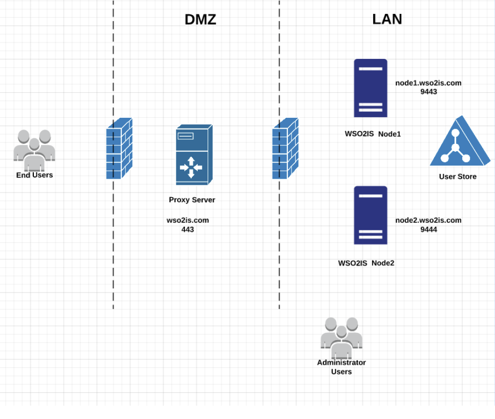
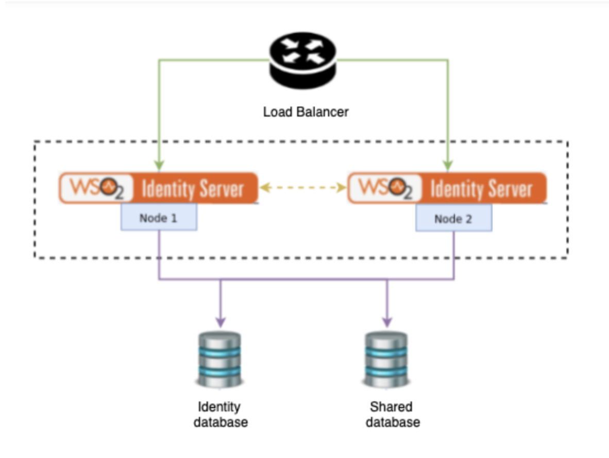

# WSO2 Identity Server Deployment and Maintenance Best Practices Guide

[Deployment Plan](#deployment-plan)

* [Where should WSO2IS be deployed?](#where-should-wso2is-be-deployed)

* [Security Best Practices for Deployment](#security-best-practices-for-deployment)

* [Choosing Deployment Pattern](#choosing-deployment-pattern)

	* [Clustering Patterns](#clustering-patterns)

	* [Multi regional deployment](#multi-regional-deployment)

		* [When to go for multi region based deployments](#when-to-go-for-multi-region-based-deployments)

		* [PROS and CONS of multi region deployments](#pros-and-cons-of-multi-region-deployments)

		* [Data Replication](#data-replication)

* [Choosing Hardware requirements](#choosing-hardware-requirements)

* [Choosing the Userstore](#choosing-the-userstore)

	* [LDAP based userstore](#ldap-based-userstore)

		* [Pooling LDAPS connections](#pooling-ldaps-connections)

* [Setting up the Database](#setting-up-the-database)

[Choosing Deployment Platform](#choosing-deployment-platform)

* [Amazon Web Services(AWS)](#amazon-web-servicesaws)

* [Kubernetes](#kubernetes)

* [Virtual Machines](#virtual-machines)

[Server Deployment](#server-deployment)

* [Configuration best practices](#configuration-best-practices)

	* [Server configurations](#server-configurations)

	* [Super admin user configurations](#super-admin-user-configurations)

	* [Identity database configurations](#identity-database-configurations)

	* [Consent database configurations.](#consent-database-configurations)

	* [Configuring client authentication](#configuring-client-authentication)

	* [Keystores](#keystores)

	* [Configuring the Email Sending Module](#configuring-the-email-sending-module)

	* [Allowing changing of System Apps and System app origin configurations](#allowing-changing-of-system-apps-and-system-app-origin-configurations)

	* [Other Configurations](#other-configurations)

	* [Database](#database)

		* [Database pool options](#database-pool-options)

		* [PostgreSQL](#postgresql)

		* [MSSQL](#mssql)

	* [Clustering](#clustering)

	* [Cleanup Configuration](#cleanup-configuration)

	* [Userstore](#userstore)

	* [Registry](#registry)

	* [CORS Configurations](#cors-configurations)

	* [Encrypting Passwords with Cipher Tool](#encrypting-passwords-with-cipher-tool)

		* [Encrypting passwords](#encrypting-passwords)

		* [Referring the Encrypted Passwords from the deployment.toml file](#referring-the-encrypted-passwords-from-the-deploymenttoml-file)

* [Artifact Synchronization](#artifact-synchronization)

* [Performance Tuning](#performance-tuning)

	* [OS-level settings](#os-level-settings)

		* [Setting the thread execution limit for multi tenant mode.](#setting-the-thread-execution-limit-for-multi-tenant-mode)

	* [JVM settings](#jvm-settings)

* [Security](#security)

	* [Callback URL Regular Expressions](#callback-url-regular-expressions)

[Monitoring](#monitoring)

* [Log Levels](#log-levels)

	* [Enable Logs for a Component](#enable-logs-for-a-component)

* [Masking Logs](#masking-logs)

* [Log Retention](#log-retention)

* [Server Health Check](#server-health-check)

* [Proactive log monitoring](#proactive-log-monitoring)

[Operations](#operations)

* [WSO2 IS PORTS](#wso2-is-ports)

* [COOKIES](#cookies)

[Maintenance](#maintenance)

* [Database](#database-1)

	* [Data Cleanup](#data-cleanup)

	* [Indexes](#indexes)

* [Backups](#backups)

* [Certificate Renew](#certificate-renew)

* [Updates](#updates)

	* [Why use WSO2 Updates?](#why-use-wso2-updates)

	* [How to get WSO2 updates?](#how-to-get-wso2-updates)

[Artifact promoting](#artifact-promoting)

##

This document is to propagate the WSO2 identity server best practices to its customers for better deployment of the Identity server in production environments. We are listing down a set of best practices that are needed to instalI &amp; maintain the WSO2 Identity server. If you are planning to do a production deployment of the WSO2 Identity server for your organization, this article is for you.

##


## Deployment Plan

### Where should WSO2IS be deployed?

Usually WSO2IS (or any IAM product) should be deployed in the secured network (LAN) by connecting to the user store which would be also deployed in the secure network (LAN) and would not be exposed into the DMZ(Demilitarized Zone).

Management console &amp; management API of the WSO2IS usually should not be exposed to outsiders. It should be only exposed in the LAN.

End users should be authenticated from WSO2IS for login. Therefore authentication endpoints, user portals, and other web applications should be reachable by the end user.

Following is the high level deployment diagram that depicts.



WSO2IS instances have been deployed in LAN by connecting the user store and the databases which are also resided in LAN. HTTPS ports of the WSO2IS instances are exposed to the DMZ.

Proxy/Load Balancer servers should be deployed in the DMZ.HTTPS port (443) of the Proxy/LB should be exposed to an external environment.

There is a firewall between LAN and DMZ. This firewall limits the access to the LAN environment. It has a rule that only the proxy server (which is in DMZ) can access the open HTTPS ports in the WSO2IS instances in the LAN.

Further, a firewall can be used to block the management console by limiting the access to the web context &quot;/carbon&quot;. But this can be achieved through proxy servers as well.

Proxy/LB is the only entity which can access the WSO2IS instances in the LAN and it is the entry point. It contains load balancing logic and reverse proxy logic.

Authentication endpoints should be reachable for end users. There should be a reverse proxy configuration in the Proxy/LB.

Proxy/LB server should accept external requests for port 443 and it should deny the requests which are coming other than above defined reverse proxy endpoints.

There is a firewall between DMZ and the external network. This firewall can allow only port 443 for external clients.

Mostly Proxy/LB server is bridging the SSL (Terminate the SSL). Therefore, there is a separate SSL connection with external clients and Proxy/LB server and another connection with Proxy/LB server and WSO2IS instances. Therefore, the SSL certificate which is exposed to outside would be the Proxy/LB server&#39;s certificate.

In a clustered environment where there’s multiple WSO2 product servers fronted by a load balancer, sticky sessions should be enabled at the load balancer level. Therefore, requests from the same session will be redirected to the same IS node.


### Security Best Practices for Deployment

- Load balancer should be fronted with firewall having necessary rules
- Should implement mechanism to protect from DDOS attacks
- Intrusion Detection System (IDS) that monitors network traffic for unusual or suspicious activity and sends an alert to the administrator should be placed
- Implement Continuous Security Vulnerability Scanning
- Regularly Apply Security Updates to Your Environment

### Choosing Deployment Pattern

It&#39;s recommended to have at least two WSO2 identity servers in the production deployments to achieve the following with local clustering enabled.

1. **High Availability:** If one node becomes unavailable or is experiencing high traffic, another node will seamlessly handle the requests.
2. **Load Balancing:** Multiple nodes can handle the traffic together so that cluster throughput is higher than the throughput of a single node.



#### Clustering Patterns

1. Active-Active - All the nodes are in active mode and serving requests

1. Active-Passive - Some of the nodes are in passive mode(not serving requests) and once active node is down, passive node becomes active and serve requests

#### Multi regional deployment

##### When to go for multi region based deployments

- When Low Latency for geographically dispersed users is needed
- When Multi-region high availability is needed (disaster recovery)
- When having a Regulatory compliance - not having to store sensitive information outside the region it belongs to

##### PROS and CONS of multi region deployments

PROS:

- Minimizing transactional latency by placing data physically close to end users
- Eliminating outages with redundancies that can survive entire region or cloud failures
- Aiding with data privacy compliance by storing data within local boundaries

CONS:

- It&#39;s difficult to recruit IT professionals for maintaining multiple regions
- Running and maintaining multiple regions increases cost
- Increases operational overhead

##### Data Replication

WSO2 IS data can be broadly categorized into three significant types as

1. Identity and entitlement data (username, user password, user attributes, roles and user-role assignments, etc.)
2. Configuration data (service providers, identity providers, XACML policies, etc.)
3. Operational data (user sessions, OAuth2 access tokens, logs, analytics, etc.)

multi-region deployment use cases for WSO2 IS:

1. Sync identities, entitlements and configuration across all regions
2. Sync only configuration across regions but partition identities and entitlements by region
3. Partition all data by the region they belong to

we&#39;ve left out replication of operational data from all the scenarios. This is because replicating operational data can be very costly due to very frequent updates and WSO2 IS doesn&#39;t have an in-built mechanism to sync operational data across regions, relying solely on the database replication technology to handle this.

Furthermore, refer to article [1](https://wso2.com/library/articles/2018/04/multi-region-deployment-for-wso2-identity-server-part-1/) and [2](https://wso2.com/library/articles/2018/04/multi-region-deployment-for-wso2-identity-server-part-2/) regarding multi-region deployment.

### Choosing Hardware requirements

It&#39;s highly recommended to have a minimum of three environments (Prod,Pre Production and dev/test) at least as the identity server deployment. Starting from the initial deployment plan there are certain things that you need to consider for selecting the environment resources.

Following are the minimum recommendations for a basic Identity server deployment. Refer to the [documentation](https://is.docs.wso2.com/en/latest/setup/deployment-guide/) for more information.

- 4 vCPUs or more
- 4 GB RAM or more (4 GB Heap for IAM server Prefered) (Server Memory 8GB)
- 10 GB Disk Space minimum or more

\* The above recommendations can change based on the expected concurrency &amp; performance.

There are different deployment patterns (Single node,Multi node) for the identity server deployment. Hence you need to first choose the correct pattern for your deployment based on the business requirements, such as TPS, Analytics, Number of users, Cost. refer to the [document](https://is.docs.wso2.com/en/latest/setup/deployment-guide/) for further details.

### Choosing the Userstore

WSO2 Identity server shipped with default userstore as an embedded H2 DB for the primary userstore. However it is **NOT-RECOMMENDED** to use for the Production &amp; it is recommended only for development tasks in a developer&#39;s machine. As embedded H2 DB is running inside the WSO2 identity server instance, it can&#39;t be scaled &amp; it has been seen that storage could be corrupt at any point of time; especially with the load. Since data is the most valuable resource, customers should choose the proper userstore option for the production.

WSO2 Identity server can be connected with any LDAP based user stores or JDBC based user stores (by default it supports WSO2 specific schema for JDBC based user stores). Please refer to the [documentation](https://is.docs.wso2.com/en/latest/administer/ldap-vs-jdbc/) for more details for a better understanding.

In JDBC based stores, we use WSO2 specific schema, DDL can be found on the \&lt;wso2is\&gt;/dbscripts/\&lt;db\_name\&gt;.sql. Also it&#39;s possible to use or migrate the existing JDBC schemas from having a custom userstore.

There is no special details on setting up the JDBC user stores, you can refer to the database setting up &amp; configuration for it.

Any LDAP based user store should be set up in advance based on Vendor details that are available. WSO2 doesn&#39;t provide any specific guide for setting up the LDAP based user stores. However, configurations required for connecting to the LDAP user store would be provided.

#### LDAP based userstore

- If users are in flat hierarchy, UserDNPattern &amp; RoleDNPattern configuration should be used
- Connection Pooling should be enabled.
- Some connection pooling properties should be set into the JDK run time. Refer to the [document](https://docs.oracle.com/javase/jndi/tutorial/ldap/connect/config.html) for details.
- Search &amp; List Filter should be optimal to retrieve only the required object
- User Role &amp; User DN caches should be enabled.
- User/ Role Max length should be optimized based on the requirements.
- Certificates should be in the client trust store or SSL certificate validation using a configuration.

##### Pooling LDAPS connections

Connection pooling does not apply to LDAPS connections (SSL-enabled LDAP connections) by default. Therefore, you need to enable connection pooling for LDAPS connections at the time of starting your server:

1. Stop the server.
2. Navigate to the &lt;PRODUCT_HOME&gt;/bin directory, and open the relevant startup script:

	``` 
	On Linux: wso2server.sh 
	On Windows: wso2server.bat
	```

1. Add the following system property to the script:

	```
	-Dcom.sun.jndi.ldap.connect.pool.protocol=”plain ssl”
	```

1. Start the server.

### Setting up the Database

**Database Sizing**

Most of our customers found it is difficult to project the sizing for their database. Here is some formula for the initial calculation. However please note that this will be a rough value for calculating estimation of the database size, the actual values may differ depending on use cases and the database types used.

Assumption is 1 - 3 KB per a transaction, and if the projected **TPS** is **50** for the deployment. Here is the formula for calculating the rough size of the database required for a DAY use.

```
(TPS * ConvertSecondsToDay * KBPerTransaction) / (ConvertKBtoGB)(50 * 3600 * 24 * 2) / (1024 * 1024)
8 GB per Day 
```

Minimum HW requirement for DB :

Server details that we used for load testing… https://github.com/wso2/performance-is/tree/master/benchmarks

If it is not according to above benchmarks, proper capacity planning should be done. For that WSO2 team should be consulted.

**Use of Default Databases**

WSO2 Identity Server shipped with a H2 database as the default database for easy setup. However this is **NOT-RECOMMENDED** for the Production usage. As these are file based storage and can be corrupt at any point of time due to the high load. Since data is the most valuable resource, customers should choose the proper RDBMS system for storing the actual deployment data.

However the WSO2\_CARBON\_DB will keep to use the H2 database as it consist of metadata specific to the wso2 server and its safe to use the H2 database for the WSO2\_CARBON\_DB as it could recover the data by the server itself in case of the file corruption by simply removing the old file. Also there won&#39;t be heavy read/write operations for this datasource, hence its highly unlikely to get corrupted.

Identity servers support most of the RDBMS systems available in the market such as (ORACLE, SQL Server, MySQL, PostgreSQL, DB2) and Standard LDAP systems (openldap, Active directory). For more information refer to the [documentation](https://is.docs.wso2.com/en/latest/setup/working-with-databases/#working-with-databases).

**Database Separation**

One another key point of setting up the DB is correct separation of the **database schemas**. WSO2 identity server consists of multiple schemas based on its usage, Separation of the schema is highly recommended as this would give more benefits for the organization in term of arranging the data.For further details refer the [documentation](https://is.docs.wso2.com/en/latest/setup/setting-up-separate-databases-for-clustering/)


##


**Minimum databases Structure**

- H2 database

- 1 Database server

Schema of database server

- 2 minimum Schema should be created, i.e shared database &amp; identity database ( if you are not using workflow feature)

The below scripts have been executed to create each DB:

-   wso2 db identity
    -   &lt;IS_HOME&gt;/dbscripts/identity/uma/&lt;db type&gt;.sql
    -   &lt;IS_HOME&gt;/dbscripts/identity/&lt;db type&gt;.sql
    -   &lt;IS_HOME&gt;/dbscripts/consent/&lt;db type&gt;.sql
-   wso2 db shared
    -   &lt;IS_HOME&gt;/dbscripts/&lt;db type&gt;.sql
    
**Extended Database Structure**

The below scripts have been executed to create each DB:

-   wso2 db user
    -   &lt;IS_HOME&gt;/dbscripts/&lt;db type&gt;.sql
-   wso2 db identity
    -   &lt;IS_HOME&gt;/dbscripts/identity/uma/&lt;db type&gt;.sql
    -   &lt;IS_HOME&gt;/dbscripts/identity/&lt;db type&gt;.sql
-   wso2 db consent
    -   &lt;IS_HOME&gt;/dbscripts/consent/&lt;db type&gt;.sql
-   wso2 db shared
    -   &lt;IS_HOME&gt;/dbscripts/&lt;db type&gt;.sql

## Choosing Deployment Platform

## Amazon Web Services(AWS)

Refer to the [document](https://github.com/wso2/aws-is) for more information about AWS deployment.

Refer to the [document](https://is.docs.wso2.com/en/latest/setup/deployment-guide/#clustering-related-configurations:~:text=Click%20to%20see%20the%20instructions%20for%20AWS%20ECS%20membership%20scheme) for clustering schema.

## Kubernetes

Refer to the [document](https://github.com/wso2/kubernetes-is/blob/master/advanced/is-pattern-1/README.md) for more information about kubernetes deployment.

For more information about kubernetes best practices, refer to the [documentation](../Containerized-Deployments-of-WSO2-IS-Products).

Refer to the [document](https://is.docs.wso2.com/en/latest/setup/deployment-guide/#clustering-related-configurations:~:text=Click%20to%20see%20the%20instructions%20for%20Kubernetes%20membership%20scheme) for clustering schema.

## Virtual Machines

Refer to the [document](https://is.docs.wso2.com/en/latest/setup/deployment-guide/#clustering-related-configurations:~:text=Click%20to%20see%20the%20instructions%20for%20WKA%20scheme) for clustering schema.

##


## Server Deployment

## Configuration best practices

Starting for Identity server 5.9.0 , all the XML based configurations are centralized to a single file named **deployment.toml** which resides in the &lt;wso2is&gt;/repository/conf directory. Therefore going forward any custom configuration has to be done in the **deployment.toml** file and all the changes will be reflected in the respective XML files at the runtime of the server.

### Server configurations

In the deployment.toml configuration file, we need to configure the hostname of the WSO2 identity server which is going to be exposed outside the DMZ. You can configure them under the [server] element.

Sample:
```
[server]
hostname = "wso2.is.com"
node_ip = "10.172.123.207"
base_path = "https://$ref{server.hostname}:${carbon.management.port}"
````
### Super admin user configurations

After that we have to configure the super admin user of the WSO2 identity server deployment as below. The super admin user is the server admin user of the WSO2 identity server who holds special permissions when it comes to managing the server. As per the current design of the identity server there can be only one super admin user. We are configuring the super admin user configurations from the below section.

Sample:
```
[super_admin]
username = "admin"
password = "admin"
create_admin_account = true
```
###


### Identity database configurations

This is the database used by the WSO2 identity server to store identity related data such as service provider information, identity provider information, Claim metadata, etc..
```
[database.identity_db]
type = "mysql"
hostname = "localhost"
name = "identity_db"
username = "sa"
password = "$secret{db_password}"
port = "3306""
```
### Consent database configurations.

This database is used to store the consent related data provided by the user.
```
[[datasource]]
id="WSO2CONSENT_DB"
url="jdbc:mysql://hostname:3306/consent_db?autoReconnect=true&amp;useSSL=false"
username = "sa"
password = "$secret{db_password}"
driver = "com.mysql.jdbc.Driver"
jmx_enable=false
```
Below configuration is a mandatory configuration we need to add when we are using a separate JDBC database as the consent database.
```
[authentication.consent]
data_source="jdbc/WSO2CONSENT_DB"
```
### Configuring client authentication

The client authentication is a mechanism used to authenticate applications or the clients that are initiating rest API requests. In the WSO2 identity server there are several web applications that are shipped out-of-the-box.

You can find these web apps from the &lt;IS-HOME&gt;/repository/deployment/server/webapps directory. The &quot;authenticationendpoint&quot; and &quot;accountrecoveryendpoint&quot; two of them that consumes the exposed rest APIs of the identity server. Especially these two uses client authentication to authorize rest API requests initiated by them.

Below section is used to configure the application password from the authentication endpoint web application as well as the accountrecoveryendpoint web application. In below the default configurations as kept.
```
[identity.auth_framework.endpoint]
app_password= "$secret{app_password}"
```
In the below we are configuring the SHA-256 hash of the newly added client app\_password for the above client app on the server side. Here also we have kept the default configurations.
```
[account_recovery.endpoint.auth]
hash = "66cd9688a2ae068244ea01e70f0e230f5623b7fa4cdecb65070a09ec06452262"
```
### Keystores

By default WSO2 Identity server comes with Single Keystore and a separate truststore (stored in the &lt;IS\_HOME&gt;/repository/resources/security/ directory). However in a production environment it&#39;s recommended to separate out the keystores for better usage. Refer to the [documentation](https://is.docs.wso2.com/en/latest/administer/configuring-keystores-in-wso2-products/) for more information.

**Primary Keystore** - Use the existing Primary Keystore for signing messages when WSO2 Identity Server communicates with external parties (such SAML, OIDC id\_token signing)
```
[keystore.primary]
file_name = "primary.jks"
password = "$secret{keystore_password}"
alias = "primary"
key_password = "$secret{key_password}"
```
**Internal Keystore** - Create a new keystore for Encrypting/decrypting passwords and other confidential information, which are maintained in various configuration files as well as internal data stores. Refer [documentation](https://is.docs.wso2.com/en/latest/administer/configuring-keystores-in-wso2-products/#configuring-a-separate-keystore-for-encrypting-data-in-internal-data-stores) for the configuration details.
```
[keystore.internal]
file_name = "internal.jks"
type = "$ref{keystore.primary.type}"
password = "$secret{keystore_password}"
alias = "internal"
key_password = "$secret{key_password}"
```
**SSL Keystore** - Create a new keystore for SSL connections / Transport. Refer to the [documentation](https://is.docs.wso2.com/en/latest/administer/configuring-keystores-in-wso2-products/#configuring-a-secondary-keystore-for-ssl-connections) for configuration details.
```
[keystore.tls]
file_name = "tls.jks"
type = "$ref{keystore.primary.type}"
password = "$secret{keystore_password}"
alias = "accountistransport"
key_password = "$secret{key_password}"
```
**Truststore**

The default trust store is used as it holds most of the root CA certificates available. This contains certificates of reputed CAs that can validate the identity of third party systems. This truststore also contains the self-signed certificate of the default wso2carbon.jks keystore.
```
[truststore]
file_name="client-truststore.jks"
password="$secret{truststrore_password}"
type="JKS"
```
Make sure that WSO2 default certificates do not exist in any of the keystores in your production environment. For example, be sure to delete the default public certificate in the default trust store that is shipped with the product.

### Configuring the Email Sending Module

In the below section we have configured the email sending configuration of the WSO2 identity server. These configurations are used to connect to the SMTP provider and send emails in various flows. Please refer to our [official documentation](https://is.docs.wso2.com/en/5.11.0/setup/configuring-email-sending/) for more details and explanation of each property.
```
[output_adapter.email]
from_address= "email@wso2.com"
username= "wso2iamtest"
password= "Wso2@iam70"
hostname= "10.172.30.60"
port= 25
enable_start_tls= true
enable_authentication= true
signature = "WSO2 Identity Server"
```
### Allowing changing of System Apps and System app origin configurations

In the WSo2 identity server 5.11.0 version there are two system applications that are shipped with the out-of-the-box product.

1. My account application - This can be used to manage the user&#39;s profile by the users themself.
2. Console application - This is yet a beta release. This can be used to manage the identity server by admin users.

By default there are two service providers created for each of these applications and they are configured as system applications. Once a service provider is configured as a system application it can not be changed unless it was withdrawn from the configuration.

The below configuration is added to set all the applications including the aforementioned ones to read write mode.
```
[system_applications]
read_only_apps = []
```
The below configuration is used to configure the server origin where the My Account web application is going to be used. Here we can control the Origin header of the requests/responses to/from My Account application to imply where it originates from/to.
```
[myaccount.idp_configs]
serverOrigin = "https://$ref{server.hostname}"

[console.idp_configs]
serverOrigin = "https://$ref{server.hostname}"
```
### Other Configurations

There are some other configurations available at the deployment.toml file as well. This section will explain the use cases of them.

This has been added to enable tenant deletion.
```
[tenant_mgt]
tenant_deletion=true
```
### Database

Configuring the correct database pool properties is important for achieving the maximum performance of the Identity server. Therefore certain sets of configurations that are common to all the databases and certain that are specific based on the database type that are being used. Hence please follow the [documentation](https://is.docs.wso2.com/en/latest/setup/performance-tuning-recommendations/#jdbc-pool-configuration) for common configuration.

**Database specific configuration**

#### Database pool options
```
[database.xxx_db.pool_options]
defaultAutoCommit=false
commitOnReturn=true
testOnBorrow = true
validationQuery="SELECT 1" # This query can be varied with DB type
removeAbandoned = true
removeAbandonedTimeout = 60
logAbandoned = false 
```

#### PostgreSQL

**Increese**  **max\_wal\_size**

Postgres checkpoint is set to 5 minutes and if the WAL generated during that time is greater than the default max wal size (1 GB) there will be frequent flush happen to the disk, which will decrease the performance of the database. This has to be verified with your DBA and configure the correct value based on the TPS expected. Further reading refers to the [documentation](https://www.postgresql.org/docs/9.6/wal-configuration.html).

**Commit on Return**

Due to the default behavior of the postgreSQL, all the SELECT queries also have to be committed. Otherwise there will be a low commit ratio and cause certain locks due the postgreSQL holds up that connection until it receives the commit. However in Identity server we do not make commits for SELECT statements, Hence this will lead into an inconsistent state. Therefore to avoid the same postgreSQL configurations should include the property commitOnReturn and set it to true as follows.
```
[database.xxx_db.pool_options]
defaultAutoCommit= false
commitOnReturn=true
```

#### MSSQL

Set SendStringParametersAsUnicode to &#39;false&#39; in order to overcome a limitation in the Microsoft SQL client driver. Without this parameter, the database driver will erroneously convert VARCHAR data into NVARCHAR and lower the database&#39;s performance.

Sample configuration
```
[database.user]
url = "jdbc:sqlserver://localhost:1433;databaseName=userdb"
username = "root"
password = "root"
driver = "com.microsoft.sqlserver.jdbc.SQLServerDriver"
```

**READ COMMITTED Behavior**

By default, the MSSQL Server uses shared locks to prevent other transactions from modifying rows while the current transaction is running a read operation. When this is the case, if multiple read statements are trying to execute for the same table, there might be a deadlock situation.

Therefore, in order to overcome this, we have to change this default behavior from READ\_COMMITTED\_SNAPSHOT being off to READ\_COMMITTED\_SNAPSHOT being on for the databases.
```
ALTER DATABASE <DATABASE_NAME> SET ALLOW_SNAPSHOT_ISOLATION ON
ALTER DATABASE <DATABASE_NAME> SET READ_COMMITTED_SNAPSHOT ON WITH ROLLBACK IMMEDIATE 
```
### Clustering

When using the WSO2 identity server with more than one node, it&#39;s recommended to enable clustering to maintain the consistency between the nodes. WSO2 uses hazelcast as the clustering engine. Please refer to the [documentation](https://is.docs.wso2.com/en/latest/administer/clustering-overview/) for more details. In addition to the cluster configuration, if the network between the two nodes is not stable, it could cause hazelcast to be not-responsive, Therefore following properties are required to be added to the deployment.toml file inorder to handle the hazelcast to disconnect from the other node if there is a network connectivity issue.
```
[hazelcast]
'hazelcast.shutdownhook.enabled'= false
'hazelcast.heartbeat.interval.seconds'="1"
'hazelcast.master.confirmation.interval.seconds'="5"
'hazelcast.max.no.heartbeat.seconds'="20"
'hazelcast.max.no.master.confirmation.seconds'="30"
```

WSO2 supports the following membership schemes for clustering - well-known address (WKA) - Multicast membership - AWS membership - AWS ECS membership - Kubernetes membership. Please refer to the [documentation](https://is.docs.wso2.com/en/latest/setup/deployment-guide/#clustering-related-configurations) for more details

### Cleanup Configuration

WSO2 identity server, comes with a pre packaged cleanup module for housekeeping the identity related unused data. This is helpful to maintain the database growth. However as this housekeeping is performed from the JAVA level, there could be a performance issue if you try to use the maximum use out of the identity server. In such heavy use cases it&#39;s recommended to turn off the default housekeeping and enable the cleanup from the stored procedures. Stored procedures are more efficient and those should be scheduled in the database with the help of your DBA, However for general usage this is not required. Please refer to the maintenance section for more details of the stored procedures.
```
[session_data.cleanup]
enable_expired_data_cleanup = false
clean_logged_out_sessions_at_immediate_cycle = false
enable_pre_session_data_cleanup = false

[oauth.token_cleanup]
enable = false 
```
###


### Userstore

In WSO2 Identity server, username is considered as case insensitive, Hence all the username queries fired to the database will have a lower(UM\_USER\_NAME) function, However this is not required for some of the databases like MySQL is treat all the queries as case insensitive.

Therefore it&#39;s recommended to set the case insensitive parameter to false for databases like MySQL and SQL Server. Otherwise the provided Indexes in the product dbscripts will not affect. Refer section [indexes](#indexes) for creating the correct indexes.
```
[user_store] 
properties.CaseInsensitiveUsername = false
properties.UseCaseSensitiveUsernameForCacheKeys = false 
```
Realm manager is a mandatory configuration we need to add when we are using the JDBC database as the primary user store.
```
[realm_manager]
data_source = "WSO2USER_DB"
```
The below part is used to configure and point the external database server to use for primary user store. As you can observe below we are configuring the url, username, password, and the JDBC driver to be used.
```
[database.user]
url= "jdbc:mysql://hostname:3306/user_db?autoReconnect=true&amp;useSSL=false"
username = "wso2_user"
password = "$secret{db_password}"
driver = "com.mysql.jdbc.Driver"
```
###


### Registry

In the WSO2 identity server the registry is a content store and a metadata repository for various artifacts such as services, WSDLs and configuration files. These artifacts are keyed by unique paths where a path is similar to a Unix file path. In WSO2 products, all configurations pertaining to modules, logging, security, data sources and other service groups are stored in the registry by default.

The registry kernel of WSO2 provides the basic registry and repository functionality. WSO2 products use the services provided by the registry kernel to establish their own registry spaces, which are utilized for storing data and persisting configuration.

Registry sharing with other WSO2 products, it is not recommended to use the same registry database with other WSO2 products such as APIM or EI.

WSO2 Identity Server comprises three different registry repositories.

1. **Local Repository:** Store configuration and runtime data that is local to the server.

1. **Configuration Repository:** Store product-specific configurations.

1. **Governance Repository:** Store configuration and data that are shared across the whole platform. This typically includes services, service descriptions, endpoints or data sources.

Below configuration is used to point out the database to be used for the registry.
```
[database.shared_db]
type = "mysql"
url="jdbc:mysql://hostname:3306/shared_db?autoReconnect=true&amp;useSSL=false"
username = "wso2_user"
password = "$secret{dbuser_password}"
```
For more information about the registry, see [working with the Registry](https://is.docs.wso2.com/en/latest/administer/working-with-the-registry/).

### CORS Configurations

Cross Origin Resource Sharing (CORS) is a mechanism that allows the web services to control the access to its resources from different origins. The WSO2 Identity Server supports enforcing CORS at the tenant level. This is particularly useful when a Single Page Application (SPA) is needed to be connected to the IS. Any CORS origin that will be made allowed at the deployment stage through the deployment.toml will always be enabled for all the tenants under that particular WSO2 IS instance.

The below are the default CORS configurations that come with the identity server. Here we only have changed the hostnames of allowed origins to allow the required origins to access the identity server. Please refer to the [official documentation](https://is.docs.wso2.com/en/latest/learn/cors/) for more information.
```
[cors]
allow_generic_http_requests = true
allow_any_origin = false
allowed_origins = [
	"https://$ref{server.hostname}",
	"https://localhost"
]
allow_subdomains = false
supported_methods = [
	"GET",
	"POST",
	"HEAD",
	"OPTIONS"
]
support_any_header = true
supported_headers = []
exposed_headers = []
supports_credentials = true
max_age = 3600
tag_requests = false
```
### Encrypting Passwords with Cipher Tool

This section explains how plain text passwords in configuration files can be encrypted using the secure vault implementation that is built into WSO2 Identity Server.

#### Encrypting passwords

Open the server configuration file (deployment.toml file) in the &lt;IS\_HOME&gt;/repository/conf/ directory and add the &quot;[secrets]&quot; configuration section at the bottom of the file as shown below. Now we have to provide an alias for the password type followed by the actual password. Below I have listed several of them.
```
[secrets]
admin_password = "[password_1]"
dbuser_password = "[password_2]"
keystore_password = "[password_3]"
key_password = "[password_4]"
truststrore_password = "[password_5]"
app_password = "[password_6]"
```
Then navigate to the &lt;IS\_HOME&gt;/bin/ directory in a command prompt, and execute the following command to encrypt the passwords.
```
On Linux: ./ciphertool.sh -Dconfigure
On Windows: ciphertool.bat -Dconfigure
```
Then go back to the deployment.toml file and see that the alias passwords are encrypted. When you have encrypted passwords, you can refer to them in the configuration file using the alias.


#### Referring the Encrypted Passwords from the deployment.toml file

After encrypting, the encrypted password can be referred to with the &quot;$secret{alias}&quot; placeholder as below.
```
[super_admin]
password="$secret{admin_password}"

[database.user]
password = "$secret{dbuser_password}"

[keystore.tls]
password = "$secret{keystore_password}"
key_password = "$secret{key_password }"

[truststore]
password = "$secret{keystore_password}"
```
For more information on this please refer to our [official documentation](https://is.docs.wso2.com/en/5.11.0/setup/encrypting-passwords-with-cipher-tool/).

##


## Artifact Synchronization

In a multi node setup of the WSO2 Identity server, we need to synchronize some of the artifacts using a file server in order to replicate the changes made to the one node to the other nodes. Following are the such files that should be shared using the shared file server like NFS or Rsync. These can be ignored if relevant features are not used in the deployment.

- Userstores which is reside in the &lt;wso2is&gt;/repository/deployment/server/userstores/
- Tenants which is reside in the &lt;wso2is&gt;/repository/deployment/tenants/
- Workflow engine related artifacts
  - &lt;wso2is&gt;/repository/deployment/server/humantasks/
  - &lt;wso2is&gt;/repository/deployment/server/bpel/

## Performance Tuning

Also please refer to the performance tuning recommendations given in the [documentation](https://is.docs.wso2.com/en/latest/setup/performance-tuning-recommendations/). For tuning the host and the wso2 identity server for better performance. Also you can refer to the [benchmarks](https://github.com/wso2/performance-is/tree/master/benchmarks) of the standard identity server deployment we have used.

### OS-level settings

It is recommended to configure the local DNS entries in the identity server instances for all the external entities such as DB server, SMTP server, LB server, other IS node host etc.

#### Setting the thread execution limit for multi tenant mode.

In multi-tenant mode, the Carbon runtime limits the thread execution time. That is, if a thread is stuck or taking a long time to process, Carbon detects such threads, interrupts and stops them. Note that Carbon prints the current stack trace before interrupting the thread. This mechanism is implemented as an Apache Tomcat valve. Therefore, it should be configured in the &lt;IS\_HOME&gt;/repository/conf/deployment.toml file as shown below.
```
[catalina.valves.valve.properties]
className = "org.wso2.carbon.tomcat.ext.valves.CarbonStuckThreadDetectionValve"
threshold="600"
```
The className is the Java class name used for the implementation. This must be set to org.wso2.carbon.tomcat.ext.valves.CarbonStuckThreadDetectionValve

The threshold gives the minimum duration in seconds after which a thread is considered stuck. The default value is 600 seconds.

### JVM settings

JVM heap size (Xmx) depends on your load. Given below are the general settings but if you are in a production environment, this might not be sufficient . In such situations, you can increase the heap size accordingly .

For instance, if you want to increase the JVM heap size to 4GB, open wso2server.bat or wso2server.sh located in &lt;IS\_HOME&gt;/bin/ and do the following changes.
```
JVM_MEM_OPTS="-Xms4096m -Xmx4096m"
```
##


## Security

As security is one of the most important factors, It&#39;s highly recommended to follow the WSO2 identity server security hardening practices for any production deployment. Refer to the [documentation](https://is.docs.wso2.com/en/latest/administer/security-guidelines-for-production-deployment/#security-guidelines-for-production-deployment) for more information.

In addition to the above mentioned, it&#39;s recommended to follow the WSO2 Identity server [deployment guide](https://is.docs.wso2.com/en/latest/setup/installing-the-product/) and the [administrator guide](https://is.docs.wso2.com/en/latest/administer/wso2-administration-guide/) before any deployment.

### Callback URL Regular Expressions

For password recovery, you can define a regular expression to validate the callback URL. The default configuration allows any callback URL. Note that if you are using the recovery option, it is highly recommended to define the regular expression that validates and only allows access to specific callback URLs.

## Monitoring

System monitoring and the Logs and Alerts are very important for continuous run of the WSO2 server. Hence it&#39;s critical to have a good monitoring solution for your deployment.

WSO2 users log4j framework for the loggin and starting from the Identity Server 5.9.0 log levels can be changed at runtime. Also this can integrate with third party tools to get more insights and alerts using tools such as Splunk , Datadog , Prometheus , Azure Monitor, AWS Cloud watch.

## Log Levels

In general we have defined the INFO standard log level of the WSO2 server and customers can increase the log level to DEBUG or TRACE to see the fine level of the logs.

However in the production environment, it&#39;s recommended to have INFO as the log level for all the components as increasing the log levels could impact on the WSO2 server performance. For more details please refer to the [documentation](https://is.docs.wso2.com/en/latest/setup/monitoring-the-identity-server/).

###


###


### Enable Logs for a Component

Add a logger in the &lt;IS\_HOME&gt;/repository/conf/log4j2.properties file to define the logger. Then add the to the loggers list by comma-separate.
```
logger.<Logger_Name>.name = <Component_name>
logger.<Logger_Name>.level = <Log_level>

loggers = AUDIT_LOG, trace-messages, ..., <Logger_Name>
````
For example:
```
logger.org-wso2-carbon-identity-core.name = org.wso2.carbon.identity.core
logger.org-wso2-carbon-identity-core.level = DEBUG

loggers=org-wso2-carbon-identity-core,trace-messages,org-apache-coyote,com-hazelcast

```
## Masking Logs

Based on the business requirements it is required to mask sensitive information from the logs, in such case WSO2 provides the capability to mask such information using the regex based patterns. Please refer to the [documentation](https://is.docs.wso2.com/en/latest/setup/masking-sensitive-information-in-logs/).

## Log Retention

In a production system it is recommended to move old logs to a different location to prevent the hard disk from filling. The log retanting policies can be found from the &lt;IS-HOME&gt;/repository/conf/log4j2.properties file. Here you can configure the carbon log file appender to configure the server log file. Below are the recommended configurations that we shipped with the product itself. If you need to configure the log retention according to an organization policy below configs could be used to configure them.
```
appender.CARBON_LOGFILE.policies.type = Policies
appender.CARBON_LOGFILE.policies.time.type = TimeBasedTriggeringPolicy
appender.CARBON_LOGFILE.policies.time.interval = 1
appender.CARBON_LOGFILE.policies.time.modulate = true
appender.CARBON_LOGFILE.policies.size.type = SizeBasedTriggeringPolicy
appender.CARBON_LOGFILE.policies.size.size=10MB
appender.CARBON_LOGFILE.strategy.type = DefaultRolloverStrategy
appender.CARBON_LOGFILE.strategy.max = 20
```
To configure log4j2 you may refer to the configurations from log4j2 [website](https://logging.apache.org/log4j/2.x/manual/appenders.html) as well.

## Server Health Check

WSO2 Identity server provides an API to check the server health, Please refer to the [documentation](https://is.docs.wso2.com/en/latest/setup/monitoring-server-health/#monitoring-server-health) for more details.

## Proactive log monitoring


It is recommended to proactively monitor logs via a third-party log analysis tool to identify the below scenarios in order to identify and alert relevant parties.

| **String** | **Severity Level** | **Alert** |
| --- | --- | --- |
| FATAL | Severe | A fatal error occurred: Server is about to go out of service. |
| OutOfMemory | Severe | The server is out of memory. The server is about to go out of service. |
| ThreadDeath | Severe | Threads are hanging and the server will go out of service if this continues. |
| java.io.IOException: Too many open files | Severe | The server is in high load. Soon it will go out of service. |
| Pool empty | High | The server is in high load. Soon it will go out of service. |
| Deadlock | High | A database deadlock has been detected. If this continues, the server will go out of service. |
| SlowQueryReport | Medium | Database slowness has been detected. |
| ConnectException: Connection timed out | Medium | Network Failure or Slowness in the Network detected. |
| java.net.SocketException: Connection reset | Medium | Network Failure or Slowness in the Network detected. |
| java.net.SocketException: Broken pipe | Medium | Network Failure or Slowness in the Network detected. |
| Unable to find valid certification | Medium | The identity server can not find a valid certificate to create a secure connection with the external endpoint. |
| CertificateExpiredException | Medium | SSL certificate to an external entity is expired. |

##


## Operations

## WSO2 IS PORTS

| **Port** | **Usage** |
| --- | --- |
| 9443 | HTTPS servlet transport |
| 9763 | HTTP servlet transport |
| 10389 | Used in WSO2 products that provide an embedded LDAP server |
| 8000 | Used to expose the Kerberos key distribution center server |
| 11111 | RMIRegistry port. Used to monitor Carbon remotely |
| 9999 | RMIServer port. Used along with the RMIRegistry port when Carbon is monitored from a JMX client that is behind a firewall |
| 45564 | Opened if the membership scheme is multicast |
| 4000 | Opened if the membership scheme is wka |

Please refer to the [documentation](https://is.docs.wso2.com/en/latest/references/default-ports-of-wso2-products/) for more details.

## COOKIES

| Cookie | Usage |
| --- | --- |
| JSESSIONID | This cookie is used to track the session with the web app the user is dealing with in a particular flow |
| commonAuthId | It is set to the user&#39;s browser with the hostname of WSO2 Identity Server instance and the value of the commonauthId cookie is the SSO session identifier. When the SSO session is created in the WSO2 Identity Server, the session is put into the session cache and persisted to the database. |
| opbs | When the OIDC session starts, OpenID Provider(OP) will send the obps cookie to the Relying Party(RP). So all the RPs sharing the same browser session will have the same obps cookie and the OP server will store that in a database for the particular browser session. |
| samlssoTokenId | When a user logs in to a SAML service provider the samlssoTokenId cookie is set. During the logout, the identity server would read this cookie to identify the session information and remove this cookie afterward. |
| requestedURI | This cookie is used to keep track where the user needs to be sent after authenticating to the management console. |
| atbv | This cookie is used in OIDC cookie base SSO binding |
| wso2.carbon.rememberme | Remember me cookie used in the management console |

## Maintenance

WSO2 Identity server required a set of maintenance activities to be performed in the long run. Please refer to the following best practices that make the WSO2 identity server smooth in the long run.

## Database

### Data Cleanup

As it was mentioned above, WSO2 server comes with pre-packed housekeeping activity for general maintenance. However as it could have some performance impact of the heavy usage of the wso2 server, it&#39;s recommended to turn off the pre-packed housekeeping and enable stored procedures to clean up the unused data.

Cleanup using the stored procedures, Refer all the stored procedures available [here](https://github.com/wso2/carbon-identity-framework/tree/master/features/identity-core/org.wso2.carbon.identity.core.server.feature/resources/dbscripts/stored-procedures). Mainly We have 2 cleanup procedures as follows. These should be compiled and scheduled by the DBA.

1. Session data cleanup
2. Oauth2 Token data cleanup

|  Database Type  | Token Cleanup Procedure  | Session Cleanup Procedure  |
| --- | --- | --- |
| DB2 | [DB2  Location](https://github.com/wso2/carbon-identity-framework/blob/master/features/identity-core/org.wso2.carbon.identity.core.server.feature/resources/dbscripts/stored-procedures/db2/token-cleanup/oauth2-token-cleanup.sql) | [DB2 Location](https://github.com/wso2/carbon-identity-framework/blob/master/features/identity-core/org.wso2.carbon.identity.core.server.feature/resources/dbscripts/stored-procedures/db2/sessiondata-cleanup/db2-session-data-cleanup.sql) |
| MSSQL | [MSSQL Location](https://github.com/wso2/carbon-identity-framework/blob/master/features/identity-core/org.wso2.carbon.identity.core.server.feature/resources/dbscripts/stored-procedures/mssql/token-cleanup/mssql-tokencleanup.sql) | [MSSQL  Location](https://github.com/wso2/carbon-identity-framework/blob/master/features/identity-core/org.wso2.carbon.identity.core.server.feature/resources/dbscripts/stored-procedures/mssql/sessiondata-cleanup/mssql-session-data-cleanup.sql) |
| MySQL | [MySQL Location](https://github.com/wso2/carbon-identity-framework/blob/master/features/identity-core/org.wso2.carbon.identity.core.server.feature/resources/dbscripts/stored-procedures/mysql/token-cleanup/mysql-token-cleanup.sql) | [MySQL Location](https://github.com/wso2/carbon-identity-framework/blob/master/features/identity-core/org.wso2.carbon.identity.core.server.feature/resources/dbscripts/stored-procedures/mysql/sessiondata-cleanup/mysql-session-data-cleanup.sql) |
| Oracle | [Oracle Location](https://github.com/wso2/carbon-identity-framework/blob/master/features/identity-core/org.wso2.carbon.identity.core.server.feature/resources/dbscripts/stored-procedures/oracle/token-cleanup/oracle-token-cleanup.sql) | [Oracle Location](https://github.com/wso2/carbon-identity-framework/blob/master/features/identity-core/org.wso2.carbon.identity.core.server.feature/resources/dbscripts/stored-procedures/oracle/sessiondata-cleanup/oracle-sessiondata-cleanup.sql) |
| PostgreSQL 9.X and 10.x | [PostgreSQL 9.X Location](https://github.com/wso2/carbon-identity-framework/blob/master/features/identity-core/org.wso2.carbon.identity.core.server.feature/resources/dbscripts/stored-procedures/postgresql/postgre-9x/token-cleanup/postgresql-token-cleanup.sql) | [PostgreSQL 9.X Location](https://github.com/wso2/carbon-identity-framework/blob/master/features/identity-core/org.wso2.carbon.identity.core.server.feature/resources/dbscripts/stored-procedures/postgresql/postgre-9x/sessiondata-cleanup/postgresql-session-data-cleanup.sql) |
| PostgreSQL 11.X or newer | [PostgreSQL 11.X Location](https://github.com/wso2/carbon-identity-framework/blob/master/features/identity-core/org.wso2.carbon.identity.core.server.feature/resources/dbscripts/stored-procedures/postgresql/postgre-11x/token-cleanup/postgresql_11-tokencleanup.sql) | [PostgreSQL 11.X Location](https://github.com/wso2/carbon-identity-framework/blob/master/features/identity-core/org.wso2.carbon.identity.core.server.feature/resources/dbscripts/stored-procedures/postgresql/postgre-11x/sessiondata-cleanup/postgresql_11-session-data-cleanup.sql) |

### Indexes

Also one of the other important things is the database indexes. WSO2 shipped the most of the required indexes in the default product db scripts. Hence creating the database using the DDL should create the required indexes.

However there are certain cases where these indexes get updated and should require a change based on the configurations. Hence its DBA responsibility to propagate the same to the database for the optimum performance.

1. If the userstore is configured to use case insensitive usernames with the databases like Oracle, PostgreSQL, SQLServer DBA should create the respective indexes with lower(UM\_USER\_NAME) functionality. Refer section [userstore](#_38s8lnf3lt92) for more details.

2. New indexes introduced with WUM updates will not reflect in the database, Hence its the maintenance team responsibility to create such indexes in the database with the help of DBA.

3. The usage of the indexes can differ from the business use cases. In such cases based on the DBA suggestion, if such indexes have not any usage. it&#39;s safe to drop the same.

## Backups

If there are no DR sites available, in order to recover from a disaster situation it is recommended to create database backups regularly. It is also recommended to have file system backups of the identity server home directory regularly for the same purpose.

Please refer to the [documentation](https://is.docs.wso2.com/en/latest/administer/backup-and-recovery-recommendations/) for more information.

## Certificate Renew

It&#39;s very important to renew the certificates before they expire. Usually when the certificates are obtained from a CA, they will notify the respective user email before the certificate expires to renew the same. In case, if that is missed it&#39;s the responsibility of the maintenance team to implement a trigger to get to know about the certificate expiry or keep some reminders created as a practice. Please refer to the [documentation](https://is.docs.wso2.com/en/latest/administer/renewing-a-ca-signed-certificate-in-a-keystore/) for more information.

## Updates

It is very important to keep updated your product with the latest updates provided by the WSO2, Hence WSO2 will release the security updates, Bug fixes and performance improvements via the Updates. Therefore it&#39;s the responsibility of the maintenance team to define a regular maintenance window and update the product with the latest updates available.

When performing the update it should follow the basic practices that are used for any software update, As this should be first applied into the lowest environment first and verify all the test cases are passed and then followed by the other environments and finally with the production environment.

Please refer to the [documentation](https://updates.docs.wso2.com/en/latest/) for more information.

### Why use WSO2 Updates?

Continuous maintenance of your software solution ensures system health and security throughout its lifetime. The WSO2 Update service delivers fixes to subscribers in an ease of use format throughout the product life cycle.

- Utilizing all available updates, eliminates the possibility of being stymied by a known issue during your evaluation or development.
- A support request often results in an improvement, or a fix which is built, well-tested, and delivered to you as an update.
- WSO2 Updates give you immediate access to a surge of improvements, packaged for easy deployment into your production systems, making sure the deployment is solid and secure.
- Update Channels deliver all updates or exclusively security updates to fit your project lifecycle.
- Update Services are available for WSO2 releases for Ten years, thus you can exploit bug and security fixes while remaining free to manage your upgrade schedule.
- We carefully monitor hundreds of open source projects, collect and assess security reports from users or academia, run code security reviews and automate code analysis to identify and address possible security weaknesses.

### How to get WSO2 updates?

A subscription is mandatory to get WSO2 updates. A Subscription can be obtained by following manner.

Update tool is a CLI distribution that is separate for Linux, MacOS and Windows distributions. Bringing the product up to date with the Update Tool is very easy. It is as simple as running one of the commands that matches with your Operating System.

The following commands should be performed in command prompt under the directory path of &lt;IS\_HOME&gt;/bin

Update Commands for OS,
```
On Linux: wso2update_linux
On Mac: wso2update_darwin
On Windows: wso2update_windows.exe
```
##


## Artifact promoting

It&#39;s recommended to maintain lower environments(at least 3) properly and test new artifacts such as customized jars, new configuration changes etc in lower environments before promoting to production environment.

**Service providers** - Tested SP in the lower environment can be exported as a file and then import it to the next upper environment for testing.

**Identity providers** - Manual insert from the management console or using [REST APIs](https://is.docs.wso2.com/en/latest/develop/idp-rest-api/) to create.

**Custom claims** - Manual insert from the management console or using [REST APIs](https://is.docs.wso2.com/en/latest/develop/claim-management-rest-api/) to create.
